# Practica Calificada 4

## Inyeccion de Dependencias

Interfaces para la creacion de nuevos tipos de enemigos y torres

Enemy:

- BasicEnemy
- BossEnemy
- FastEnemy

Estas clases retornar un objeto de la clase Enemy mediante el metodo `createEnemy()` con diferentes argumentos dependiendo del tipo de enemigo que sean

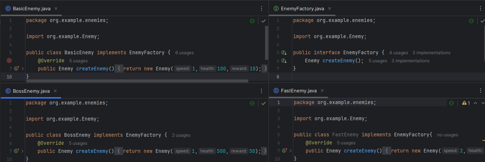

Tower:

- CannonTower
- SniperTower

Estas clases retornar un objeto de la clase Tower mediante el metodo `createTower()` con diferentes argumentos dependiendo del tipo de torre que sean

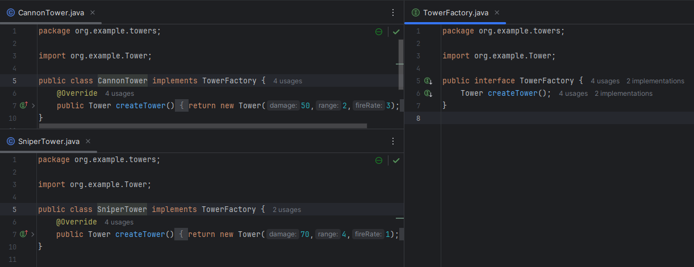

## Implementacion de Pruebas

### Pruebas de mutacion

Implementa pruebas de mutación para verificar la calidad de las pruebas unitarias.

- **¿Qué herramienta utilizarías para realizar pruebas de mutación en este proyecto, y cómo la configurarías?**

Pitest

- **Configura la herramienta de pruebas de mutación para el proyecto y ejecuta un análisis de mutación en la clase TowerDefenseGame**

Agregamos las dependencias necesarias en nuestro build gradle para correr pitest y luego verificamos el reporte

plugin pitest

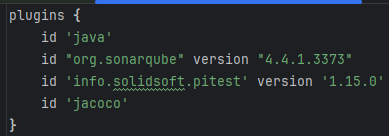

dependencias para ejecutar pitest

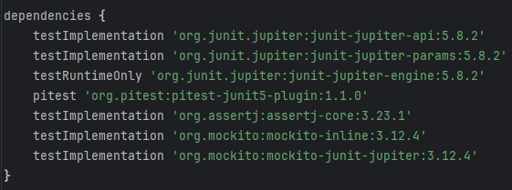

Opciones de configuracion de pitests

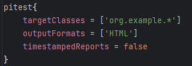

### Evaluación de cobertura de pruebas

- **¿Cómo interpretarías los resultados de las pruebas de mutación y qué acciones tomarías para mejorar la cobertura de las pruebas?**

Los resultados indican que no se tiene una buena cobertura de codigo, esto es por varias razones:

- El proyecto esta incompleto, faltan agregar funcionalidades
- Metodos getters y setters innecesarios

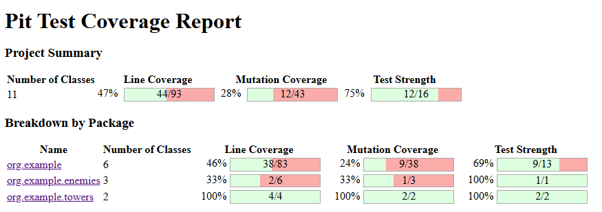

- **Implementa mejoras en las pruebas unitarias basándote en los resultados de las pruebas de mutación y explica las razones de cada cambio.**

Vamos a enfocarnos en el codigo desarrollado

Esto nos dice que faltan agregar pruebas para los metodos isValidPosition asi como para el placeTowers

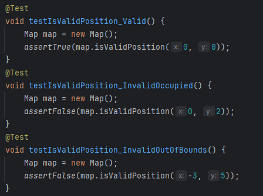

Verificamos los metodos especificos 1 por 1, asi como tambien agregamos codigo a los ya creados para evitar redundancias

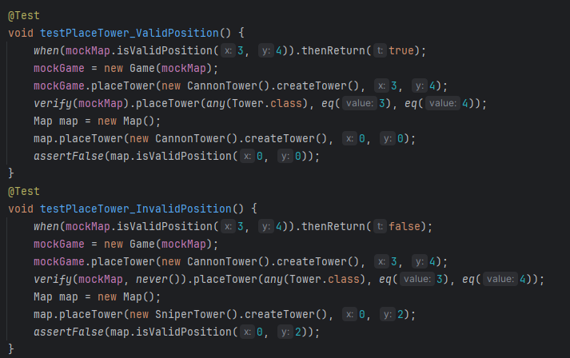

Y este es el resultado

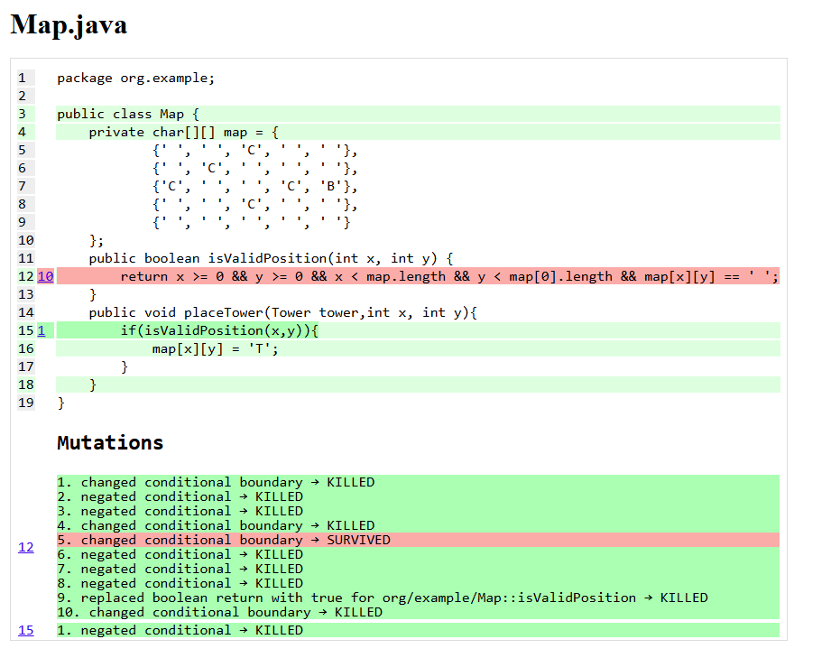

Hay una mejora, sin embargo se sigue teniendo poca cobertura y esto es por los getters y setters innecesarios, los borramos y este es el resultado

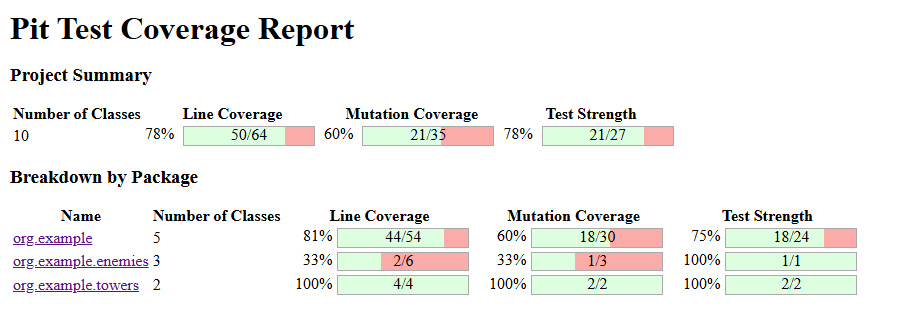

Ahora si hay una diferencia considerable, revisamos que lo que no se esta revisando son clases que no utilizamos como por ejemplo BossEnemy o SpeedyEnemy

## Preguntas de diseno e Implementacion

### Diseño de la clase Map

- **¿Cómo implementarías la clase Map para representar el mapa del juego, asegurando que se  puedan agregar y verificar posiciones de torres y caminos?**

Para implementar la clase Map primero usaria un grid de tipo char para poder trabajar facilmente con las posiciones dentro del mapa y usarlas para colocar/verificar torres y caminos

- **Implementa un método en la clase Map llamado isValidPosition(int x, int y) que verifique si una posición es válida para colocar una torre.**

Para verificar si una posicion dentro de nuestro mapa sea valida primero verificamos que la casilla este vacia y tambien que este dentro del rango permitido, una vez hecho esto retornamos true o false en caso sea valido o no. En este caso estamos trabajando con un mapa predefinido 5x5 es por eso que x & y deben ser menores que 5.

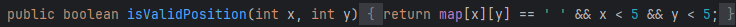

### Enemigos con diferentes características

- **Diseña e implementa una clase SpeedyEnemy que herede de Enemy y tenga una velocidad mayor pero menos vida**

Esta clase si bien no hereda directamente de Enemy implementa la interfaz EnemyFactory que devuelve un objeto del Tipo Enemy con los argumentos adecuados 

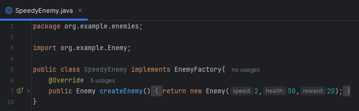

- **¿Cómo gestionarías el movimiento de los enemigos en el mapa, asegurando que sigan el camino predefinido?**

No implementado

### Torres con diferentes habilidades

- **Implementa una clase SniperTower que tenga un daño alto y un alcance muy largo pero una  velocidad de disparo baja.**

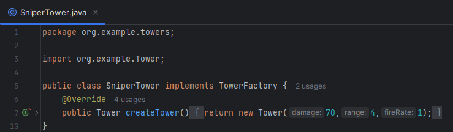

- **¿Cómo implementarías el método attack(List<Enemy> enemies) en la clase Tower para atacar a los enemigos dentro de su alcance?**

Primero tendria como parametro una lista de puros objetos Enemy, luego recorro esta lista, calculo la distancia que hay entre el enemigo y la torre, por ultimo verifico que la distancia sea menor o igual que el rango de la torre y actualizo la vida del enemy usando getters, setters y el damage de la torre

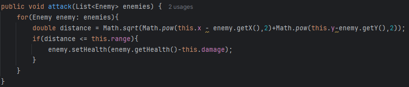

### Sistema de oleadas

- **¿Cómo diseñarías la generación de oleadas para que cada oleada sea progresivamente más difícil?**

Usaria la variable waveNumber para identificar el numero de oleadas, luego iterar sobre esta multiplicada por 5 para que se agreguen enemigos en cada oleada y que cada 5 oleadas haya un boss por ultimo retornaria la lista de los enemigos

- **Implementa un método en la clase Wave llamado generateEnemies() que genere los enemigos  de la oleada y los coloque en el mapa.**

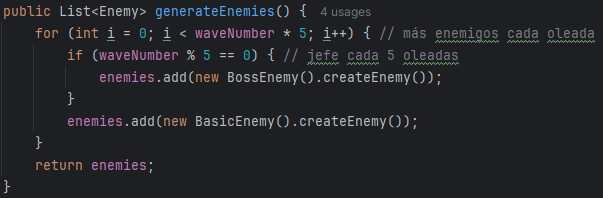

### Sistema de puntuación y salud de la base

- **¿Cómo actualizarías la puntuación del jugador y la salud de la base cuando un enemigo es derrotado o alcanza la base?**

Verifico si se ha vencido al enemigo o no, en caso lo haya hecho agrego score al jugador utilizando el atributi reward del enemigo, caso contrario le quito vida a la base usando como damage la vida del enemigo

- **Implementa un método en la clase Player llamado updateScoreAndHealth(Enemy enemy, boolean defeated).**

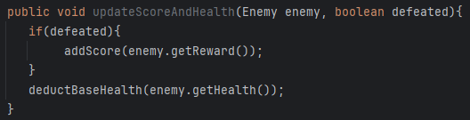

## Pruebas Estructurales

### Cobertura de ramas

`testPlaceTower_ValidPosition` y `testPlaceTower_InvalidPosition` son tests muy parecidos. Ambos simulan posiciones validas o no dentro de un mockMap, una vez se haya hecho uso del metodo placeTower se verifica que la torre (ya sea de cualquier tipo) se haya colocado en la posicion correcta o no

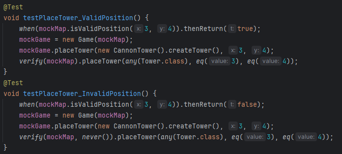

### Cobertura de condiciones

En estos tests se verifican todas las condiciones del metodo attack de la clase Tower.`testAttack_EnemyInRange` crea una lista con un solo Enemigo y una torre sniper, luego obtiene la posicion del enemigo y establece la posicion de la torre, por ultimo ataca al enemigo y verifica que haya recibido damage. `testAttack_EnemyOutOfRange` funciona muy parecido solo que usa un CannonTower y este esta muy alejado del enemigo entonces cuando ataca no hace damage.

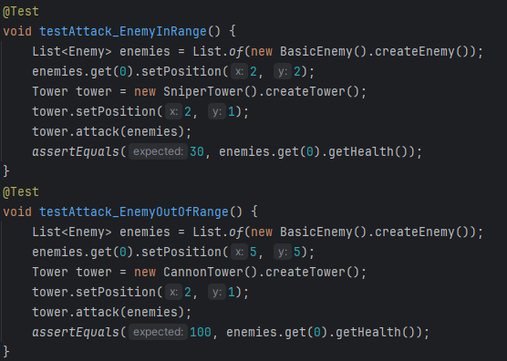

### Cobertura de Rutas

Aca se van a cubrir los casos en los que se inicie una wave con o sin enemigos.
`testStartWave_WithEnemies` instancia un objeto del tipo que game que utiliza mocks del mapa y de la oleada para simular las rutas respectivas. Una vez inicia la wave `startWave()` verifica que la lista de enemigos no sea vacia, es decir se hayan agregado correctamente. `testStartWave_NoEnemies` se asegura que al llamar al metodo `generateEnemies()` no se agregue ni un enemigo mediante el uso de mocks por ultimo verifica que la lista este vacia.

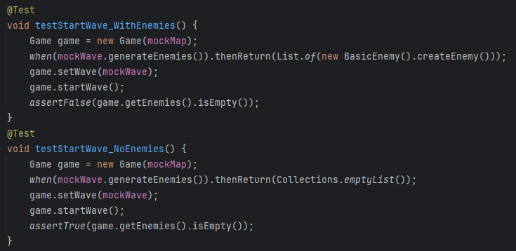

## Ejecucion de pruebas

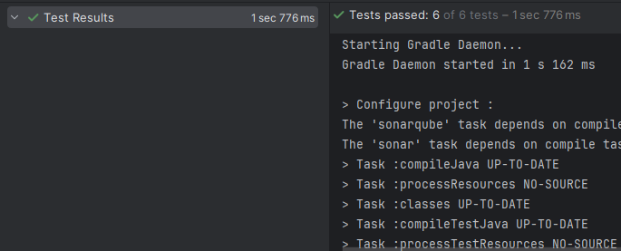

## Preguntas de Pruebas con Mockito

### Mocking de dependencias

- **¿Cómo usarías Mockito para crear un mock del Map y probar la colocación de torres en la clase TowerDefenseGame?**

Utilizando un mock de la clase mapa simularia que la posicion (3,4) es una posicion valida, entonces al momento de llamar al metodo placeTower pasandole como argumentos una torre de cualquier tipo y la posicion (3,4) deberia colocar la torre. Esto se verifica utilizando `verify` de mockito

- **Implementa un test con Mockito para verificar que el método placeTower solo permite colocar torres en posiciones válidas del mapa.**

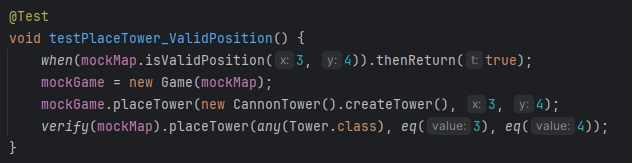

### Stubbing de métodos

- **¿Cómo usarías stubs en Mockito para simular el comportamiento del método getEnemies en la clase Wave durante las pruebas?**

Los stubs son utilizados para devolver un valor en especifico, en este caso utilizaremos un stub para que nos devuelva una lista de enemigos basicos, luego agregamos esa wave a nuestro game y verificamos que no este vacio

- **Implementa un test que use un stub para verificar el comportamiento del método startWave en la clase TowerDefenseGame**

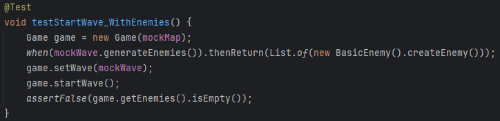